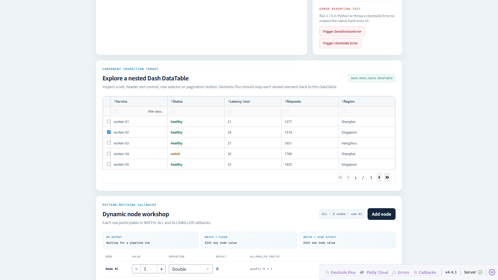
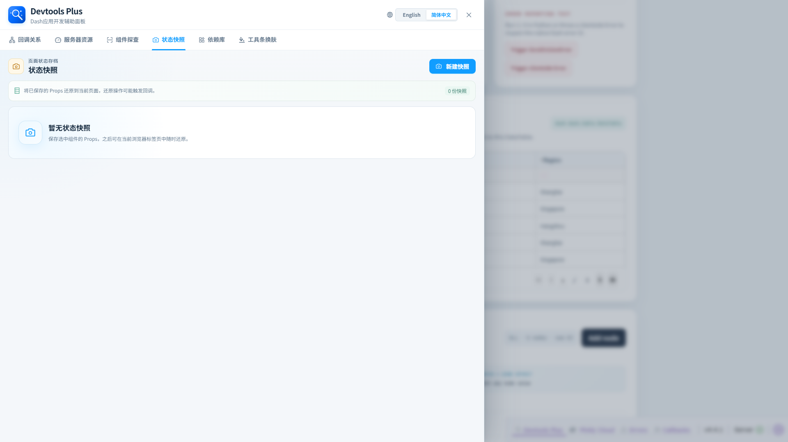

<p align="center">
  
</p>

<h1 align="center">Dash Devtools Plus</h1>

<p align="center">
  基于 Dash Hooks 的 Dash 应用开发期探查与辅助面板。
</p>

<p align="center">
  <a href="./README.md">English</a>
</p>

Dash Devtools Plus 在 Dash 原生 Dev Tools 中扩展出一个专注的抽屉面板，用于查看回调关系、探查组件、保存状态快照、梳理直接导入依赖、观察服务器资源，以及调整原生工具栏外观。它只会在明确开启调试的 Dash 会话中出现，避免在普通生产使用中暴露开发元数据。

## 打开 Devtools Plus

以调试模式启动 Dash 应用后，在原生右下角工具栏中点击 **Devtools Plus**。



抽屉打开后，仍可同时看到正在运行的应用页面。



## 快速开始

```bash
pip install dash-devtools-plus
```

```python
from dash import Dash, html
from dash_devtools_plus import configure_devtools_plus

configure_devtools_plus(default_locale="zh-CN")

app = Dash(__name__)
app.layout = html.Div("Hello, Dash Devtools Plus")

if __name__ == "__main__":
    app.run(debug=True)
```

安装后，Dash 会通过 Dash Hooks 自动发现本包。需要自定义时，请在创建 `Dash` 实例前调用 `configure_devtools_plus`。仅当调试模式与 Dash 原生 Dev Tools UI 同时开启时，面板才会显示。

完整说明见[快速开始](./docs/zh-CN/quick-start.md)。

## 功能板块

| 工作区 | 能做什么 | 功能文档 |
| --- | --- | --- |
| 服务器资源 | 实时查看 CPU、内存、磁盘与主机/运行环境信息。 | [查看说明](./docs/zh-CN/features/server-metrics.md) |
| 回调关系 | 搜索回调图数据、源码位置、角色列表、Docstring 与执行元数据。 | [查看说明](./docs/zh-CN/features/callbacks.md) |
| 组件探查 | 点击页面已渲染元素，定位其 Dash 组件、布局路径与当前 Props。 | [查看说明](./docs/zh-CN/features/component-inspector.md) |
| 状态快照 | 保存选中组件的 Props，并在当前浏览器标签页中恢复。 | [查看说明](./docs/zh-CN/features/state-snapshots.md) |
| 依赖库 | 按标准库、Dash 组件库、Dash Hooks 库和其他库整理项目直接导入项。 | [查看说明](./docs/zh-CN/features/dependencies.md) |
| 工具条换肤 | 预览并应用 Dash 原生 Dev Tools 工具栏与错误展示主题。 | [查看说明](./docs/zh-CN/features/toolbar-skins.md) |

## 配置

```python
from pathlib import Path
from dash_devtools_plus import configure_devtools_plus

configure_devtools_plus(
    default_locale="zh-CN",
    accent_color="#119DFF",
    editor="vscode",
    project_root=Path(__file__).resolve().parent,
)
```

| 参数 | 默认值 | 简述 |
| --- | --- | --- |
| `default_locale` | `"en"` | 初始界面语言：`"en"` 或 `"zh-CN"`。 |
| `accent_color` | `"#119DFF"` | 界面主强调色。 |
| `editor` | `"vscode"` | 源码打开时首选的编辑器：`"vscode"`、`"cursor"`、`"pycharm"` 或 `None`。 |
| `project_root` | `None` | 服务器端使用的项目源码与直接导入扫描边界，必须是存在的目录。 |
| `editor_project_root` | `None` | Dash 服务端与本地浏览器/IDE 文件路径不同时，编辑器可见的项目根目录。 |

配置行为、校验规则和容器服务端连接本地编辑器的示例见[配置参数](./docs/zh-CN/configuration.md)。

## 示例应用

[`examples/`](./examples/) 中提供了三个复杂度递进的应用：

| 示例 | 重点 | 运行方式 |
| --- | --- | --- |
| `simple` | 一个服务端回调和一个客户端回调。 | `python examples/simple/app.py` |
| `intermediate` | 使用 Dash 内置组件构建的旅行预算规划器。 | `python examples/intermediate/app.py` |
| `comprehensive` | 用于全功能验收的大型回调实验室。 | `python examples/comprehensive/app.py` |

它们默认共用 `8050` 端口，请一次只运行一个。使用完整回调实验室前请阅读[示例应用](./docs/zh-CN/examples.md)。

## 开发

按仓库约定配置开发环境后，运行：

```bash
python -m pytest
npm run test:frontend
npm run build
```

Python 代码使用 Ruff 检查：

```bash
ruff check .
ruff format --check .
```

前端构建产物会写入 `dash_devtools_plus/assets/`；修改前端源码后应重新构建并提交这些发布资源。

## 文档导航

- [中文文档中心](./docs/zh-CN/README.md)
- [快速开始](./docs/zh-CN/quick-start.md)
- [配置参数](./docs/zh-CN/configuration.md)
- [示例应用](./docs/zh-CN/examples.md)
- [English documentation index](./docs/en/README.md)

## 开源协议

本项目基于 [MIT License](./LICENSE) 开源。
