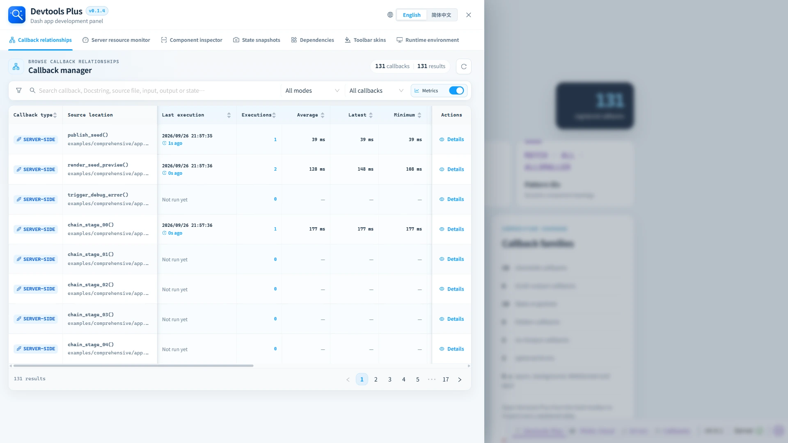

<p align="center">
  
</p>

<h1 align="center">Dash Devtools Plus</h1>

<p align="center">
  <a href="https://pypi.org/project/dash-devtools-plus/"></a>
  <a href="https://pypi.org/project/dash-devtools-plus/"></a>
  <a href="https://github.com/CNFeffery/dash-devtools-plus/actions/workflows/ci.yml"></a>
  <a href="./LICENSE"></a>
</p>

<p align="center">
  A Dash development and debugging enhancement plugin ✨, powered by Dash Hooks.
</p>

<p align="center">
  English | <a href="./README-zh_CN.md">简体中文</a>
</p>

✨ Dash Devtools Plus adds a focused drawer to Dash's native Dev Tools: trace callbacks, inspect components, capture state, understand direct imports, watch server resources, collect runtime context, and tailor the toolbar—all while keeping the running app in view. It is available only in an explicitly debug-enabled Dash session, so development metadata stays out of ordinary production use.

## 🚀 Open Devtools Plus

Start a Dash application in debug mode, then select **Devtools Plus** from the native toolbar in the lower-right corner. The drawer opens over the application, ready for a closer look.



## ⚡ Quick start

```bash
pip install dash-devtools-plus -U
```

After installation, Dash automatically discovers and registers Devtools Plus through its `dash_hooks` entry point. No `dash_devtools_plus` import or `configure_devtools_plus()` call is needed when the default settings are sufficient.

```python
from dash import Dash, html

app = Dash(__name__)
app.layout = html.Div("Hello, Dash Devtools Plus")

if __name__ == "__main__":
    app.run(debug=True)
```

The panel appears only when debug mode and Dash's native Dev Tools UI are both enabled. To override the defaults, call `configure_devtools_plus()` before creating the `Dash` instance.

For full installation notes, see [Quick start](./docs/en/quick-start.md).

## 🧭 Workspaces

| Workspace | What it provides | Documentation |
| --- | --- | --- |
| Callback relationships | Searchable callback graph data, source locations, lifecycle performance history, payload sizes, and execution metadata. | [Open guide](./docs/en/features/callbacks.md) |
| Server resource monitor | Live CPU, memory, disk, and host/runtime information. | [Open guide](./docs/en/features/server-metrics.md) |
| Component inspector | Click a rendered page element and map it to its Dash component, layout path, and current props. | [Open guide](./docs/en/features/component-inspector.md) |
| State snapshots | Capture selected component props and restore them within the current browser tab. | [Open guide](./docs/en/features/state-snapshots.md) |
| Imported dependencies | Direct project imports grouped as standard library, Dash components, Dash Hooks, or other libraries. | [Open guide](./docs/en/features/dependencies.md) |
| Toolbar skins | Preview and apply native Dash Dev Tools toolbar and error-display themes. | [Open guide](./docs/en/features/toolbar-skins.md) |
| Runtime environment | Collect essential Python, system, browser, and third-party package versions, then copy an issue-ready report. | [Open guide](./docs/en/features/runtime-environment.md) |

## ⚙️ Optional configuration

Use `configure_devtools_plus()` only when you need to override the defaults, such as the language, accent color, editor, or project roots.

```python
from pathlib import Path
from dash_devtools_plus import configure_devtools_plus

configure_devtools_plus(
    default_locale="en",
    accent_color="#119DFF",
    editor="vscode",
    project_root=Path(__file__).resolve().parent,
)
```

| Parameter | Default | Summary |
| --- | --- | --- |
| `default_locale` | `"en"` | Initial interface language: `"en"` or `"zh-CN"`. |
| `accent_color` | `"#119DFF"` | Primary UI accent color. |
| `editor` | `"vscode"` | Preferred source editor: `"vscode"`, `"cursor"`, `"pycharm"`, or `None`. |
| `project_root` | `None` | Existing project directory used as the server-side source and direct-import boundary. |
| `editor_project_root` | `None` | Editor-visible root when the browser/IDE and Dash server use different paths. |

See [Configuration](./docs/en/configuration.md) for behavior, validation rules, and container-to-local editor examples.

## 🧪 Example applications

Four applications in [`examples/`](./examples/) cover increasingly complex use cases:

| Example | Focus | Run |
| --- | --- | --- |
| `simple` | One server callback and one clientside callback. | `python examples/simple/app.py` |
| `intermediate` | A travel-budget planner built with Dash core components. | `python examples/intermediate/app.py` |
| `comprehensive` | A large callback laboratory for acceptance testing all workspaces. | `python examples/comprehensive/app.py` |
| `fastapi` | A WebSocket-powered server-time stream with FastAPI APIs. | `python examples/fastapi/app.py` |

They share port `8050`; run one at a time. Read [Example applications](./docs/en/examples.md) before using the comprehensive callback laboratory.

## FastAPI backend

Dash's FastAPI backend requires Dash 4.2 or later. Install the optional extra,
then construct Dash with `backend="fastapi"` or provide an existing FastAPI
server:

```bash
pip install "dash-devtools-plus[fastapi]"
```

See the [`fastapi` example](./examples/fastapi/app.py) for a small server-time
stream that uses `websocket_callbacks=True`, `ctx.websocket.get_prop`, and
`set_props`, alongside custom asynchronous FastAPI APIs.

## 🛠️ Development

Use the project environments described by the repository setup, then run:

```bash
python -m pytest
npm run test:frontend
npm run build
```

Python code is checked with Ruff:

```bash
ruff check .
ruff format --check .
```

The frontend build writes distributable assets to `dash_devtools_plus/assets/`; commit those generated files whenever frontend source changes.

## 🗺️ Documentation map

- [English documentation index](./docs/en/README.md)
- [Quick start](./docs/en/quick-start.md)
- [Configuration](./docs/en/configuration.md)
- [Example applications](./docs/en/examples.md)
- [中文文档中心](./docs/zh-CN/README.md)

## 📄 License

Released under the [MIT License](./LICENSE).
