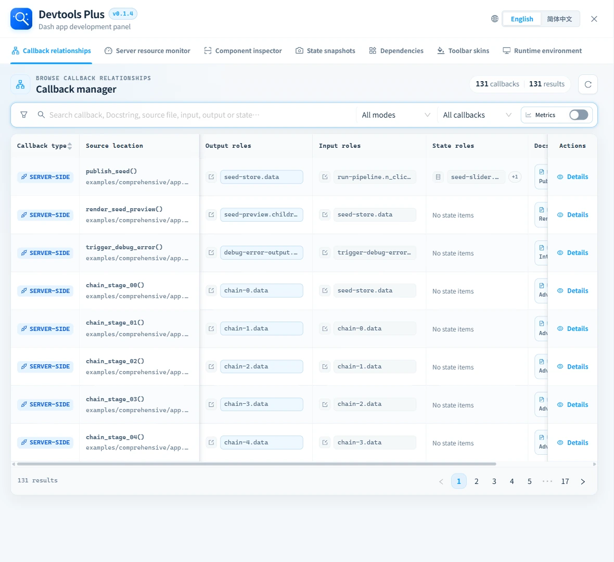
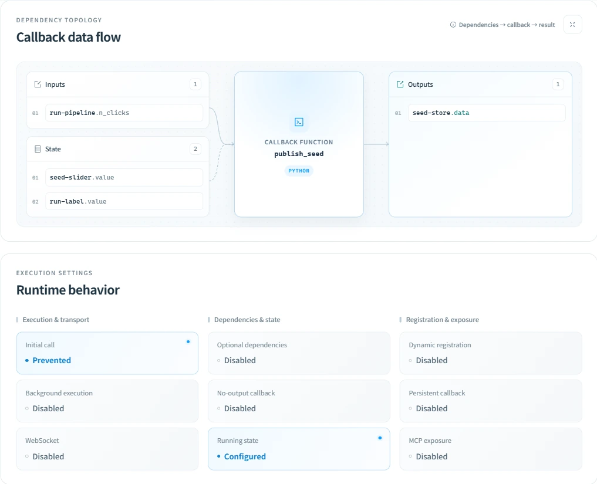
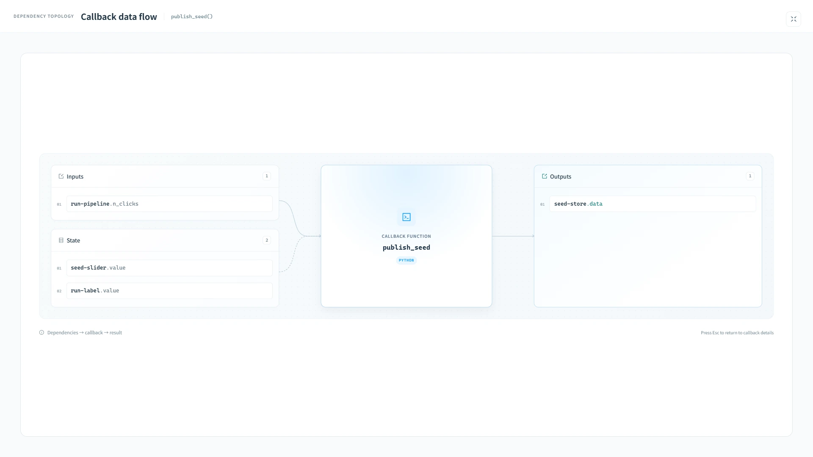
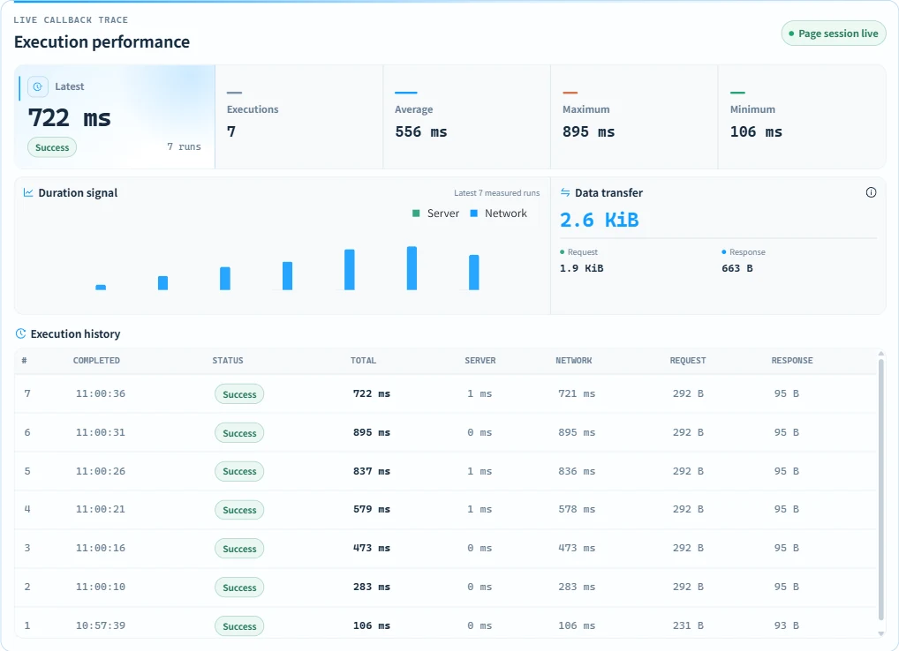

# 🔗 Callback relationships

Follow every callback edge without losing the thread: this workspace turns Dash's registered callback list into a searchable development view. ✨

This guide and its screenshots cover **0.1.4 (unreleased)**. The screenshots use real executions from the bundled examples; timings depend on the local environment.

## 🔎 Browse and filter

Search callback names, docstrings, source files, inputs, outputs, and state. Combine this with server/client and visibility filters to narrow a large application graph.

Callback type and source location stay pinned to the left while the remaining columns scroll. Every header remains on one line, cells are vertically centered, and subtle column rules make dense rows easier to scan. The Docstring cell keeps its title and a single-line preview; hover it for the complete content.

Use **Show performance metrics** to display or hide Last execution, Executions, Average, Latest, Minimum and Maximum together. The preference is persisted in the current browser. Each metric has its own flat, sortable column. Extrema tooltips explain that only captured individual timings are included.

## 📖 Read a callback row

| Column | Meaning |
| --- | --- |
| Callback type | Server-side or clientside registration. |
| Source location | Project-relative Python source and an editor action when a supported local editor is available. |
| Last execution / Executions / Average / Latest / Minimum / Maximum | Callback execution metrics for the owning Renderer on the current page; shown or hidden together from the toolbar. |
| Output / Input / State roles | The registered dependency roles, including multiple values. |
| Docstring | The Python function documentation when it is available. |
| Details | Topology, source kind, role summary, registration metadata, and runtime behavior. |

All six metrics are separate sortable columns. Each sorter starts in descending order so recently triggered, high-frequency, and slow callbacks can be brought to the top immediately; the active ordering remains applied as live measurements arrive. Last execution combines the browser's local absolute time with a live relative label: seconds for the first minute, minutes plus seconds until ten minutes, and “More than 10 min ago” thereafter. Unrecoverable completion times display “Time unavailable”.

## Callback details and fullscreen topology

Select **Details** on a callback row to inspect its source, dependency topology, runtime settings, registration metadata, and performance. Source actions can open a supported editor when a location is available.

Inputs and State flow into the function through curved connections; the output connection is straight. Connections stay static. Long dependency identifiers wrap within their cards, and larger lists scroll independently. A no-output callback shows a side-effect terminal instead of an output property list.

Runtime settings are grouped into execution and transport, dependencies and state, and registration and exposure. They describe the registered callback; the cards are read-only, not switches. Highlighted values identify enabled or configured features and prevented initial calls.

Click the fullscreen icon at the top right of **Callback data flow** to enlarge only the topology. The fullscreen view fades in and out, gives dependency lists more space, and adapts to narrow screens. Click the exit icon or press `Esc` to return to the original details without losing the scroll position; keyboard focus returns to the fullscreen button.

## ⚡ Callback performance

The performance workspace sits at the bottom of callback details. A prominent latest-duration reading includes completion status and its percentage difference from the session average. A stacked duration chart places server and network time in context, followed by a four-metric strip with explicit sample counts. Click a chart legend to show or hide its series; the selection stays in place as new executions arrive. Transfer totals stay compact, custom timing stages expand on demand, and the information button explains measurement scope. On narrow screens, the overview stacks vertically and execution records scroll within their own table. It covers the current browser page lifecycle and includes:

- execution count, average duration, latest duration, minimum, and maximum;
- a stacked duration chart for the latest 30 measured executions and five recent records, expandable to 20;
- total, server, and network duration per recorded execution;
- cumulative request and response payload sizes; and
- completion status, including successful, no-update, HTTP-error, no-response, and clientside-error outcomes.

### Read the metrics

| Metric | Coverage |
| --- | --- |
| Executions | Renderer executions plus observed HTTP failures missing from its profile. The failure subtotal includes HTTP errors, clientside errors, and no response; no-update is not a failure. |
| Latest | The most recent individually recovered duration. Missing timing is shown as `—`, including supplemented HTTP failures. |
| Average | Cumulative recorded duration divided by the number of timed executions. Untimed supplemented failures do not enter the average. |
| Minimum / Maximum | Extrema of captured individual durations across the page session, not just the currently visible history. The captured sample count is shown below each value. |
| Difference from average | Latest duration compared with the current session average, which includes that latest timed execution; it is not a comparison with the previous execution. |

The trend includes the latest 30 measured samples. The history shows the latest five records, newest first; expand it to see up to 20. A failure without timing remains in the history but does not create a zero-height timing sample. The information icon opens **Measurement notes**. Custom `ctx.record_timing` totals appear as an expandable section when the Renderer reports them.

### Data source and limits

Dash DevTools Plus differences the Renderer’s cumulative profile counters. It also observes final callback execution results to supplement HTTP 4xx/5xx failures missing from the profile, recording counts and HTTP status without inventing timings or transfer sizes. Intermediate authentication retries are not additional executions. Native clientside-error and no-response records are not counted twice. No application callback or fetch function is wrapped, and no server-side profiling state is added.

Each Renderer has an independent session, selected through the panel's Dash context. Profile resets clear the old baseline and history. A 500 ms fallback scan runs while details are open. Collection is synchronous; React notifications are throttled to 100 ms, pending chart updates are coalesced, and hidden performance tables do not subscribe to frequent updates.

The main table includes six independently sortable metrics: last execution, count, average, latest, minimum and maximum. Average covers cumulative timed executions; extrema cover only captured individual samples, whose count is shown in details. Each callback retains 200 detailed records, with the latest 30 measured samples plotted and five records displayed by default, expandable to 20. The omitted count includes cached rows outside that visible window. Pre-attachment executions never receive invented timestamps; recovered individual timings with unknown completion times show `—`. Custom `ctx.record_timing` stages appear as cumulative totals and individual history values.

HTTP timing is labeled Server and Network & other, because the remainder also includes browser processing and waiting. Unknown splits show total time only. Clientside callbacks show client time. Background totals include queueing and polling waits; WebSocket and background callbacks show only total time and no unreliable server/network breakdown or transfer sizes.

Request sizes use Dash's string-length estimate, not exact UTF-8 bytes; response sizes use `Content-Length`. Totals cover only data reported by the Renderer and exclude supplemented HTTP failures. Ambiguous zero/missing HTTP sizes appear as `—`; clientside Dash callback transfer is zero. History is page-local and disappears on a full reload. Profiling depends on Renderer internals and cannot recover pre-attachment failures already removed from execution queues and absent from the profile.

## 🛡️ Scope and safety

Only callback source files under `project_root` are treated as project sources. Set `project_root` and `editor_project_root` when server paths and local editor paths differ.
