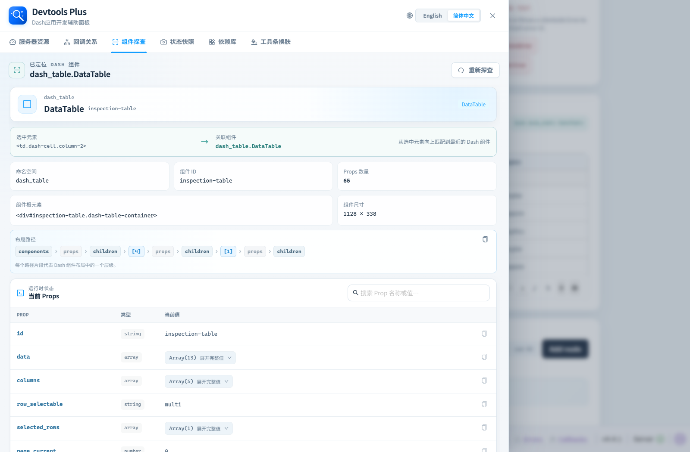

# Component inspector

The component inspector maps a rendered page element back to the closest owning Dash component.

## Workflow

1. Open **Component inspector** and select **Start component inspection**.
2. Move over the running application; the nearest supported Dash component is highlighted.
3. Click an element to reopen the panel with its component identity, DOM mapping, layout path, and current props.
4. Press `Esc` to cancel inspection without selecting an element.

## Inspection output

| Section | What it answers |
| --- | --- |
| Selected element → mapped component | Which DOM element was clicked and which Dash component owns it. |
| Identity | Namespace, component type, ID, root DOM element, and dimensions. |
| Layout path | The component's location in the Dash layout tree; it can be copied for debugging. |
| Current props | Runtime prop values, types, search, copying, and expandable structured values. |
| Nested component values | Drill into component-valued props and navigate back through the inspection trail. |

Dash development-tool namespaces are excluded so the inspector focuses on the application rather than the tool UI itself.
