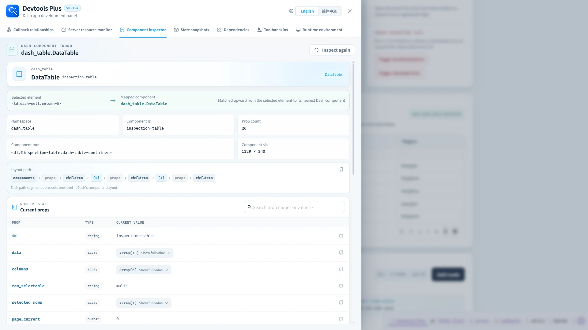

# 🔍 Component inspector

> ✨ Click what you see, then follow it back to the Dash component that owns it.

The component inspector maps a rendered page element back to the closest owning Dash component.

## 🧭 Workflow

1. Open **Component inspector** and select **Start component inspection**.
2. Move over the running application; the nearest supported Dash component is highlighted.
3. Click an element to reopen the panel with its component identity, DOM mapping, layout path, and current props.
4. Press `Esc` to cancel inspection without selecting an element.

The inspection click is intercepted before it reaches the target control, so selecting a button, input, table cell, or pagination control does not also perform that control's normal action.

## 🧩 Inspection output

| Section | What it answers |
| --- | --- |
| Selected element → mapped component | Which DOM element was clicked and which Dash component owns it. |
| Identity | Namespace, component type, ID, root DOM element, and dimensions. |
| Layout path | The component's location in the Dash layout tree; it can be copied for debugging. |
| Current props | Runtime prop values, inferred types, search, copying, editing, and expandable structured values. |
| Nested component values | Drill into registered Dash components found inside prop values, then navigate back through the inspection breadcrumb. |

Dash development-tool namespaces are excluded so the inspector focuses on the application rather than the tool UI itself.

For components with a valid ID, **Related callbacks** beside **Inspect again** opens the callback workspace, fills its search box with the component ID, and selects **Exact ID search** to exclude other IDs that merely contain the same text. This resets callback mode and visibility filters to all callbacks and returns to the first page. Dictionary IDs also find matching wildcard callbacks. Components without a valid ID do not show this action.

## Editing props

Non-component props have an edit button beside the copy button. Both page picking and inspection from state snapshots open the same editor for the component's current live value.

- Strings, numbers, and booleans select their type automatically; arrays and objects use JSON mode.
- Null or undefined values prompt you to choose a type first. Empty strings, zero, and false retain their actual types. To write null, select JSON and enter `null`.
- Strings, numbers, and JSON use a locally bundled, light Monaco Editor. Booleans provide True / False choices. Switching types preserves each mode's draft for the current dialog.
- While typing, invalid numbers and JSON use Monaco's inline squiggles and hover diagnostics. The dialog only shows a validation error after you click **Apply update**; invalid drafts leave the running app unchanged.
- **Format content** is available for strings and JSON. It normalizes JSON-like objects/arrays (including single quotes and unquoted keys) to standard JSON with double quotes and two-space indentation. Ordinary strings only have trailing whitespace removed and line endings normalized; string mode still saves a string. Formatting can be undone in the editor and does not apply the value.
- Props containing Dash components retain their drill-down inspection controls without an edit button.

**Apply update** calls `dash_clientside.set_props` and refreshes the inspection. Updates to identified components can trigger dependent callbacks; anonymous components are updated by layout path. Changes affect the running page only, leaving Python source and saved snapshots unchanged. Removed or replaced targets prompt you to inspect again.
