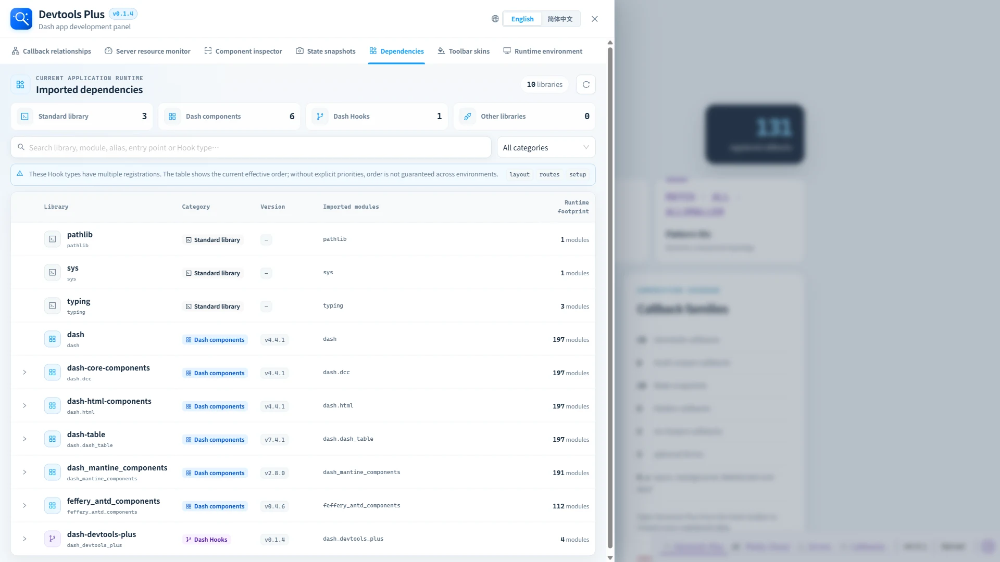

# 🧩 Imported dependencies

> ✨ See the libraries your project actually imports, without being distracted by the entire environment.

The dependency workspace summarizes libraries directly imported by the project source tree, rather than every package installed in the Python environment.

## 🗂️ Categories

| Category | Detection result |
| --- | --- |
| Standard library | Direct imports resolved to Python's standard library. |
| Dash components | `dash` itself and detected Dash component libraries. |
| Dash Hooks | Hook packages discovered through entry points or runtime registration. |
| Other libraries | Direct imports that do not fit the categories above. |

Use category cards, the category selector, and search to narrow the table. The table shows the library, category, installed version when available, imported module names, and the runtime module count.

## 🔽 Expanded details

Rows for Dash component and Hook libraries can expand:

- Component rows show package module, scope, exports, browser assets, and project aliases.
- Hook rows show entry points, source, status, hook types, and runtime registration details.

The inventory applies the configured `project_root` boundary and excludes common virtual-environment locations. Project-local modules—including Hooks registered manually from application source—are not presented as “Other” or external dependencies; a third-party import must map to an installed Python distribution to enter the inventory. It is an import-based development inventory, not a lock-file or vulnerability audit.
