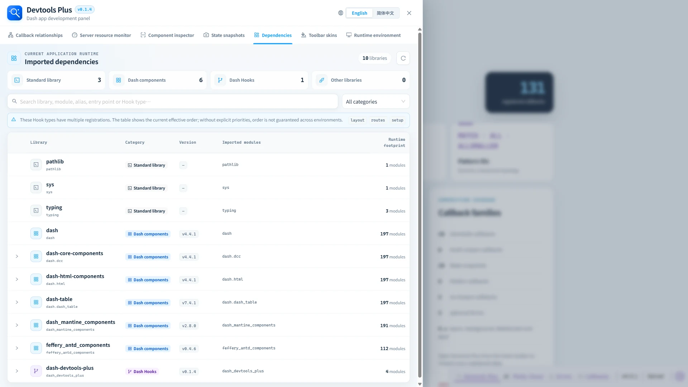

# 🧩 Imported dependencies

> ✨ See the libraries your project actually imports, without being distracted by the entire environment.

The dependency workspace summarizes libraries directly imported by the project source tree, rather than every package installed in the Python environment.

## 🗂️ Categories

| Category | Detection result |
| --- | --- |
| Standard library | Direct imports resolved to Python's standard library. |
| Dash components | `dash` itself and detected Dash component libraries. |
| Dash Hooks | Hook packages discovered through entry points or runtime registration. |
| Other libraries | Direct imports that do not fit the categories above. |

Use the clickable category cards, category selector, and search to narrow the table. Search covers library names, versions, imported modules, component aliases, Hook entry points, and Hook types. The table shows the library, category, installed version when available, imported module names, and the runtime module count.

## 🔽 Expanded details

Rows for Dash component and Hook libraries can expand:

- Component rows show package module, scope, exports, browser assets, and project aliases.
- Hook rows show entry points, source, status, hook types, and runtime registration details.

When an ordered Hook type has multiple registrations, the workspace calls out the affected types and shows their current effective order. Without explicit priorities, that order should not be assumed to stay identical across environments.

The inventory applies the configured `project_root` boundary and excludes common virtual-environment locations. Project-local modules—including Hooks registered manually from application source—are not presented as “Other” or external dependencies; a third-party import must map to an installed Python distribution to enter the inventory. It is an import-based development inventory, not a lock-file or vulnerability audit.

Without `project_root`, discovery starts from the Dash application module (including FastAPI apps), with callable layouts and callbacks as additional entry points. It follows loaded local modules rather than scanning every file or every module in the process. Static layouts also provide component evidence. Project-root selection is stable across process restarts; component implementation files are not used as application roots.

Source parsing supports Python encoding declarations, UTF-8 BOMs, relative imports and literal `importlib.import_module()` / `__import__()` calls. Refresh takes a new source and installation-metadata snapshot, so newly loaded pages and updated package metadata can be detected. Arbitrary computed imports cannot always be resolved. Unreadable source or unresolved package ownership produces an **incomplete detection** notice with module names and reasons, without exposing filesystem paths.

Distribution attribution checks module file ownership, including namespace providers and editable-install metadata when available. Active Hook packages that the application did not directly import appear separately, based on the application's Hook registration snapshot. They are not included in direct-import category counts.
