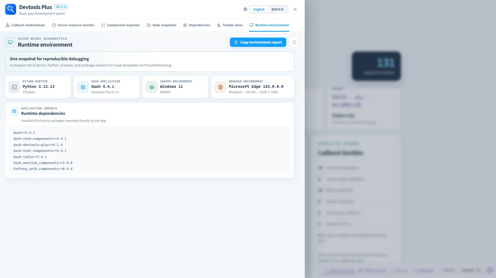

# 🧭 Runtime environment

> ✨ Collect the key context needed to reproduce an issue, then paste it directly into a report.

Runtime environment is the final workspace in the panel. It brings the active Dash server runtime, browser environment, and direct imports into one concise view.

## 📦 Included information

| Area | Details |
| --- | --- |
| Dash application | Dash and Dash Devtools Plus versions. |
| Python runtime | Python version and implementation. |
| Server environment | Operating system and release, plus architecture. |
| Browser environment | Browser and version, platform, language, and current viewport. |
| Runtime dependencies | A concise list of installed third-party packages directly imported by the app; standard-library and project-local modules are omitted. |

Select **Copy environment report** in the upper-right corner to copy a complete Markdown report for a GitHub issue, support ticket, or debugging note. Refresh reads the server details again and captures the current browser window dimensions.

Like the other Devtools Plus metadata endpoints, this endpoint is available only when Dash debug mode and the native Dev Tools UI are both enabled, and its responses are marked as non-cacheable. The report does not collect the hostname, full user agent, project paths, standard-library modules, or project-local modules.
