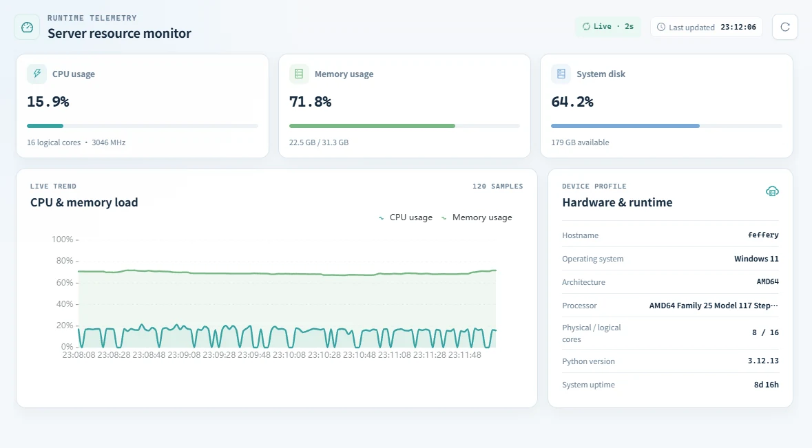

# 📡 Server resource monitor

> ✨ Keep a small, live pulse on the machine behind your Dash app while you build.

The server workspace gives a compact, live view of the process host while you develop a Dash application.

## 👀 What it shows

| Area | Information |
| --- | --- |
| Resource cards | Current CPU, memory, and system-disk usage. |
| Live trend | Recent CPU and memory samples, refreshed every two seconds while the panel is active. |
| Hardware & runtime | Hostname, operating system, architecture, processor, physical/logical cores, Python version, and uptime. |

Use the refresh action when you need an immediate sample. Telemetry is served only to an explicitly debug-enabled Devtools Plus session; it is not a production monitoring system.

## 💡 Practical use

- Confirm memory behavior while a callback updates a large figure or layout.
- Check whether a slow local interaction coincides with CPU pressure.
- Record the runtime details that accompany a reproducible development issue.
