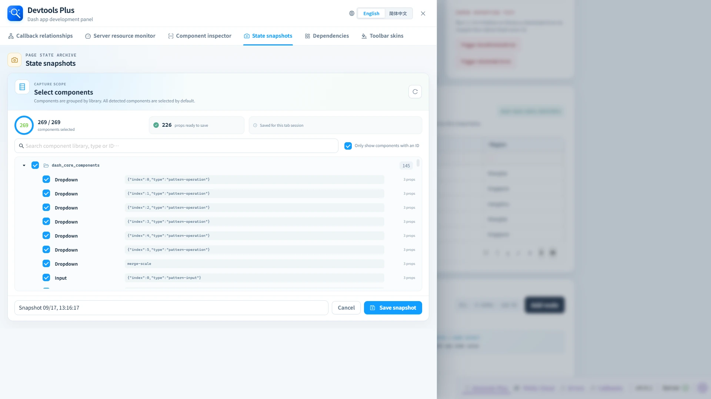

# 📸 State snapshots

> ✨ Save a useful moment during exploration, then return to it in the same tab.

State snapshots capture selected component props and restore them later in the same browser tab.

## ✨ Create a snapshot

1. Select **New snapshot**.
2. Review the components grouped by component library. Every detected component is selected, while the initial list is filtered to components with IDs.
3. Search, clear **Only components with IDs** when path-addressed components are needed, or uncheck entries that should not be captured.
4. Give the snapshot a name and save it.

## ↩️ Restore and delete

The snapshot list shows the route, creation time, component count, saved-prop count, and serialized size. Restore applies only values that differ from the current layout through Dash's clientside property update mechanism. Components that no longer match their ID/path and type are skipped, and the panel reports partial restores. A restore can trigger callbacks, so treat it as a real application state change. Deleting a snapshot cannot be undone.

## 🧱 Storage boundary

Snapshots live in browser session storage and are scoped by origin and pathname. At most 12 are retained per page in the current browser tab; they are not a server-side persistence or collaboration feature. Component-valued structural props, `id`, and values that cannot be serialized as JSON are not restored. When storage becomes full, the panel warns that newly created snapshots are only available until refresh.
