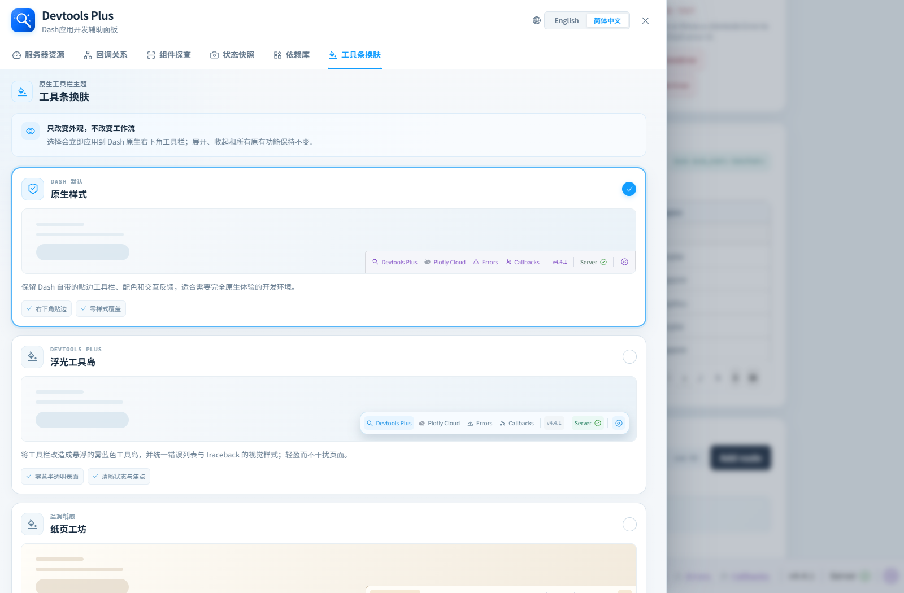

# Toolbar skins

This workspace changes the appearance of Dash's native Dev Tools toolbar and error display while retaining the native workflow.

## Available themes

| Theme | Character |
| --- | --- |
| Native style | Dash's original edge-anchored toolbar with no style overrides. |
| Luminous Dock | Floating, translucent mist-blue toolbar with aligned error styling. |
| Paper Atelier | Warm paper surface, fine rules, and amber accents. |
| Mint Circuit | Mint-white capsule toolbar with teal status feedback. |
| Coral Workbench | Soft coral hierarchy for a brighter workbench feel. |

Choose a card to apply it immediately. The selected theme is retained in browser storage, applies to the native toolbar and traceback/error surfaces, and can always be returned to **Native style**. It only affects appearance; the native toolbar's controls and behavior remain intact.
