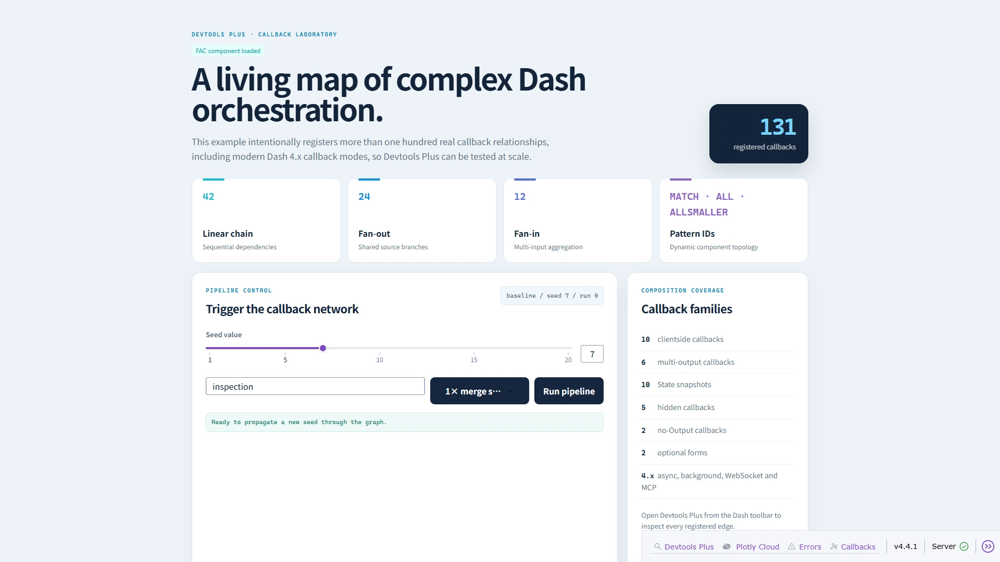

# 🧪 示例应用

仓库提供三个可直接运行的示例应用。它们均使用仓库根目录配置 `configure_devtools_plus`，因此在源码检出目录中可以直接验证插件，无需先把项目安装到环境中。

| 示例 | 用途 | 运行命令 |
| --- | --- | --- |
| `simple` | 验证最小回调图：一个服务端回调与一个客户端回调。 | `python examples/simple/app.py` |
| `intermediate` | 使用 Dash 内置组件体验聚焦的旅行预算规划场景。 | `python examples/intermediate/app.py` |
| `comprehensive` | 大规模覆盖回调拓扑、模式匹配、源码探查、快照、依赖库和工具栏主题。 | `python examples/comprehensive/app.py` |

三个示例默认均使用 `8050` 端口，请一次只运行一个，然后访问 <http://127.0.0.1:8050>。按你想验证的问题挑选复杂度，让 Devtools Plus 带你看清每个环节 ✨。

完整示例有意包含原生报错测试控件、后台与 WebSocket 注册形态，以及 100 多条回调。它适合验收与压力检查，不建议将其刻意扩张的回调拓扑直接照搬到生产应用。

