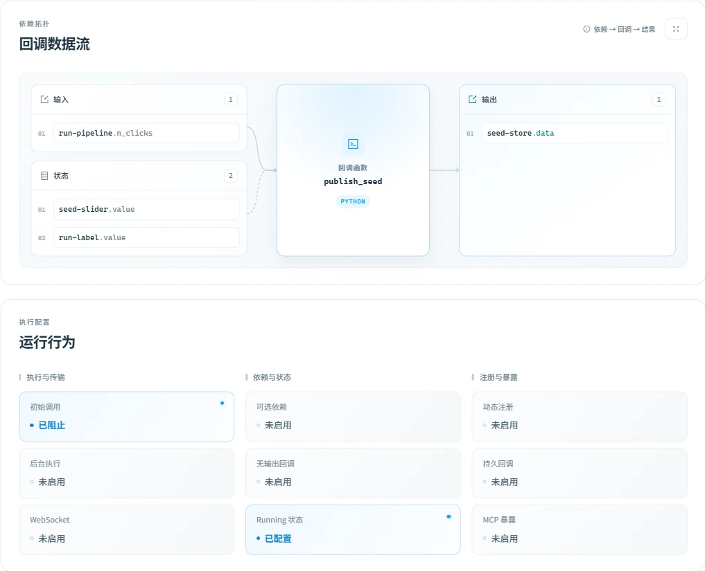
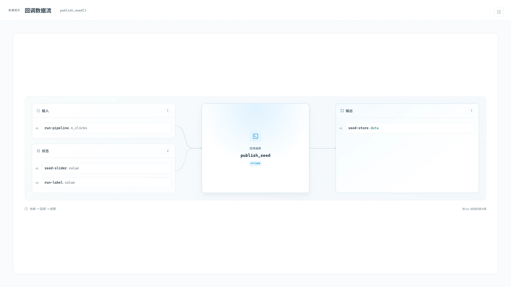

# 🔗 回调关系

顺着每一条回调边路由排查，不再丢失上下文：这里会把 Dash 已注册回调转化为可搜索的开发视图 ✨。

本页说明和截图对应 **0.1.4（未发布）**。截图使用内置示例的真实执行数据，具体耗时取决于本地运行环境。

## 🔎 浏览与筛选

可搜索回调名称、Docstring、源码文件、输入、输出和状态；再叠加服务端/客户端与可见性筛选，能够在大型应用图中快速收窄范围。

“回调类型”和“源码位置”会固定在表格左侧，横向浏览较多字段时仍能保留当前行的身份信息。所有表头均保持单行显示，单元格垂直居中并使用清晰的纵向分隔；Docstring 在表格中保留标题和一行正文，完整内容仍可通过悬浮查看。

工具栏中的“展示性能监控指标”开关可以统一显示或隐藏“最近执行、执行次数、平均耗时、最近耗时、最小耗时、最大耗时”六列，选择会持久化保存在当前浏览器中。六个性能字段采用独立的单层表头，并且都支持排序。极值列的提示说明其只覆盖已捕获的单次耗时样本。

## 📖 如何阅读一条回调

| 列 | 含义 |
| --- | --- |
| 回调类型 | 服务端回调或客户端回调注册。 |
| 源码位置 | 项目相对 Python 源码；本机存在受支持编辑器时可尝试打开。 |
| 最近执行 / 执行次数 / 平均耗时 / 最近耗时 / 最小耗时 / 最大耗时 | 当前页面中所属 Renderer 的执行指标；可通过工具栏开关统一显示或隐藏。 |
| Output / Input / State 角色 | 已注册的依赖角色，支持展示多个值。 |
| Docstring | 可获取时展示 Python 函数说明。 |
| 详情 | 拓扑、源码类型、角色概览、注册元数据和运行行为。 |

六个性能字段分别提供独立排序。每个字段首次点击均按降序排列，便于立即将最近触发、高频或高耗时回调置顶；后续实时性能数据到达时，当前排序仍会继续生效。最近执行时间同时给出本机绝对时间和相对时间：一分钟内精确到秒，1 至 10 分钟内显示“分 + 秒”，超过 10 分钟统一显示“大于10分钟前”。无法还原完成时间时显示“执行时间不可用”。

## 回调详情与全屏拓扑

点击回调行中的**详情**，可查看源码、依赖拓扑、运行行为、注册元数据及性能监控。能够定位源码时，还可通过编辑器入口尝试打开对应文件。

输入与状态通过曲线汇入函数节点，输出侧采用直线连接，连线保持静态。较长的依赖标识会在卡片内换行，多条依赖可独立滚动查看。无输出回调显示“副作用终点”，而不是输出属性列表。

运行配置按“执行与传输”“依赖与状态”“注册与暴露”分组。卡片描述回调注册时的配置，是只读信息，不是开关；启用或已配置的功能，以及被阻止的初始调用，会高亮显示。

点击**回调数据流**右上角的全屏图标，只放大拓扑部分。全屏视图采用渐入渐出过渡，为依赖列表提供更大空间，并适配窄屏。点击退出图标或按 `Esc` 返回，原详情滚动位置保持不变，键盘焦点回到全屏按钮。

## ⚡ 回调执行性能

性能区位于回调详情的最下方。最近耗时采用醒目的主读数，配合执行状态及相对会话平均耗时的变化比例；旁边的堆叠趋势图展示服务端与网络耗时的构成，下方四项统计指标注明各自样本数。点击图例可显示或隐藏对应序列，新执行记录到达时保持图例选择。传输量以轻量摘要展示，自定义阶段耗时按需展开，信息按钮提供完整统计口径。窄屏下概览纵向排列，执行记录在表格内独立滚动。这里展示当前浏览器页面生命周期内持续更新的执行记录，包括：

- 执行次数、平均耗时、最近一次耗时、最小耗时和最大耗时；
- 最近 30 条有效耗时样本的堆叠趋势图，以及默认 5 条、可展开至 20 条的执行明细；
- 每次执行的总耗时、服务端耗时和网络耗时；
- 累计请求数据量与响应数据量；
- 成功、无更新、HTTP 错误、无响应和客户端错误等完成状态。

### 如何理解指标

| 指标 | 统计口径 |
| --- | --- |
| 执行次数 | Renderer 执行数加上已观察到、但未进入其 profile 的 HTTP 失败。失败小计包含 HTTP 错误、客户端错误及无响应；无更新不属于失败。 |
| 最近耗时 | 最近一次能够单独还原的执行耗时。缺失时显示 `—`，补记的 HTTP 失败也不会被当作零耗时。 |
| 平均耗时 | 累计已记录耗时除以可计时执行次数。不带耗时的补记失败不参与平均值。 |
| 最小 / 最大耗时 | 当前页面会话中已捕获单次耗时的极值，不只覆盖当前可见历史；下方注明已捕获的样本数。 |
| 较平均耗时 | 最近耗时相对当前会话平均值的变化比例，平均值包含最近这次可计时执行；它不是与上一次执行比较。 |

趋势图展示最近 30 条可计时样本。历史按新到旧排列，默认五条，展开后最多 20 条。缺少耗时的失败仍会进入历史，但不会生成零耗时柱形。信息图标可打开**统计口径**；Renderer 报告了 `ctx.record_timing` 数据时，会出现可展开的自定义阶段累计耗时。

### 数据来源与限制

性能数据主要来自 Dash Renderer 内置的回调性能档案，通过累计计数器差分还原单次执行。对于 profile 漏记的 HTTP 4xx/5xx，监控还会观察 Renderer 的最终执行结果，补记次数、状态和 HTTP 状态码；不虚构耗时、传输量，也不把鉴权重试的中间请求算作额外执行。客户端错误和无响应仍使用原生 profile，避免重复计数。此机制不包装或重复执行应用回调，不拦截 fetch，也不在服务端增加回调状态。

每个 Renderer 独立保存统计，面板通过所属 Dash context 选择数据源；profile 重置时会清理旧基线与历史。详情打开期间，每 500 毫秒执行一次补采。采集逐次进行，界面通知最多每 100 毫秒一次；图表合并尚未绘制的更新，隐藏主表不订阅高频刷新。

每个回调最多保留 200 条详细记录，图表展示最近 30 条有效样本，表格默认展示最近 5 条、可展开至 20 条记录；未展示数量包括仍缓存但不可见的记录。平均值来自累计可计时执行，最小/最大值只来自成功还原的单次耗时，详情显示样本数。接入前的执行不生成单次记录；补采能够恢复单次耗时但不能确定完成时间时显示 `—`。自定义 `ctx.record_timing` 阶段同时展示累计值和单次明细。

耗时按回调类型解释：普通 HTTP 回调展示“服务端”和“网络及其他”，后者也包括浏览器处理、等待等；缺少可靠拆分时只画总耗时。客户端回调展示客户端耗时。后台回调的总耗时包含排队、轮询等待；WebSocket 回调也只展示总耗时，两者不展示不可靠的服务端/网络拆分或传输量。

请求量采用 Dash 的字符串长度估算，并非精确 UTF-8 字节数；响应量来自 `Content-Length`。累计量仅覆盖 Renderer 已报告的部分，不包含补记的 HTTP 失败。HTTP profile 中无法区分真实零值与缺失值时显示 `—`，客户端回调的 Dash 请求传输量为零。历史仅保留在当前页面内存，完整刷新后清空。监控依赖 Renderer 内部结构；不能追溯接入前已从执行队列移除且未进入 profile 的失败。

## 🛡️ 范围与安全性

只有位于 `project_root` 下的回调源码会被识别为项目源码。服务端路径与本地编辑器路径不同时，请同时配置 `project_root` 和 `editor_project_root`。
