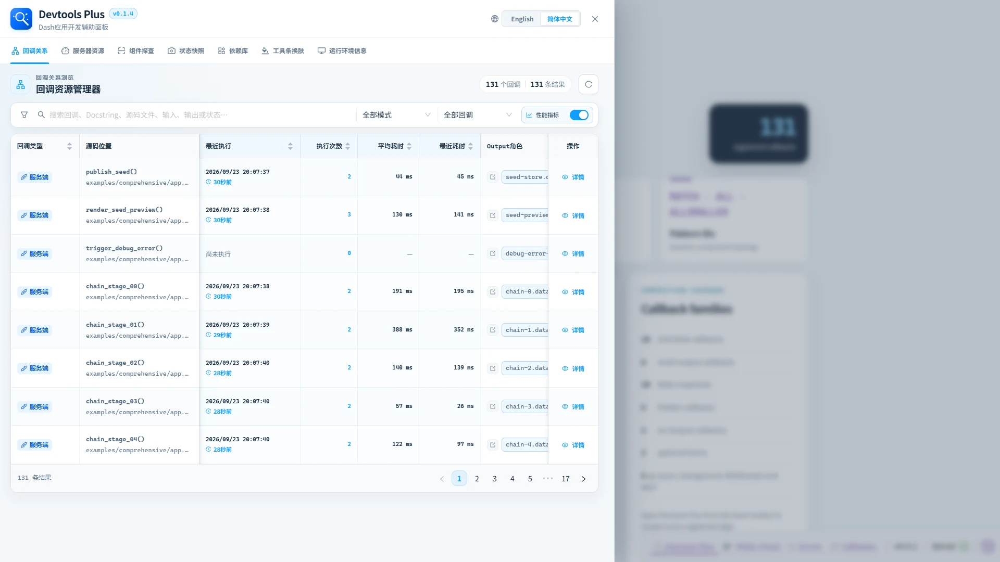
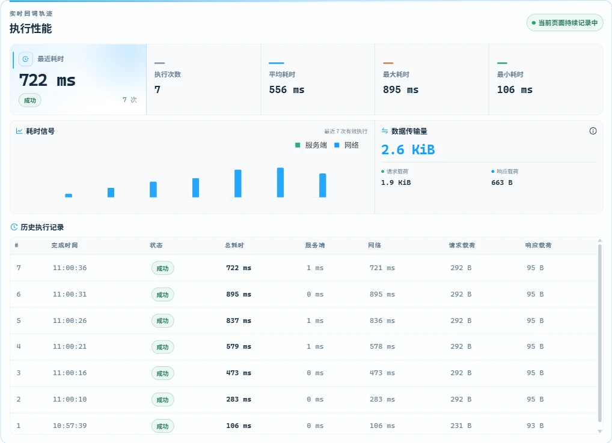

# 🔗 回调关系

顺着每一条回调边路由排查，不再丢失上下文：这里会把 Dash 已注册回调转化为可搜索的开发视图 ✨。

## 🔎 浏览与筛选

可搜索回调名称、Docstring、源码文件、输入、输出和状态；再叠加服务端/客户端与可见性筛选，能够在大型应用图中快速收窄范围。

“回调类型”和“源码位置”会固定在表格左侧，横向浏览较多字段时仍能保留当前行的身份信息。所有表头均保持单行显示，单元格垂直居中并使用清晰的纵向分隔；Docstring 在表格中保留标题和一行正文，完整内容仍可通过悬浮查看。

工具栏中的“展示性能监控指标”开关可以统一显示或隐藏“最近执行、执行次数、平均耗时、最近耗时”四列，选择会持久化保存在当前浏览器中。四个性能字段采用独立的单层表头，并且都支持排序。

## 📖 如何阅读一条回调

| 列 | 含义 |
| --- | --- |
| 回调类型 | 服务端回调或客户端回调注册。 |
| 源码位置 | 项目相对 Python 源码；本机存在受支持编辑器时可尝试打开。 |
| 最近执行 / 执行次数 / 平均耗时 / 最近耗时 | 当前页面生命周期内的回调执行指标；可通过工具栏开关统一显示或隐藏。 |
| Output / Input / State 角色 | 已注册的依赖角色，支持展示多个值。 |
| Docstring | 可获取时展示 Python 函数说明。 |
| 详情 | 拓扑、源码类型、角色概览、注册元数据和运行行为。 |

详情页还会展示 Dash 支持的相关元数据，例如初始调用、可选依赖、后台执行、动态注册、持久回调、WebSocket、无输出回调、MCP 暴露及 `running` 映射。

最近执行、执行次数、平均耗时和最近耗时分别提供独立排序。每个字段首次点击均按降序排列，便于立即将最近触发、高频或高耗时回调置顶；后续实时性能数据到达时，当前排序仍会继续生效。最近执行时间同时给出本机绝对时间和相对时间：一分钟内精确到秒，1 至 10 分钟内显示“分 + 秒”，超过 10 分钟统一显示“大于10分钟前”。

## ⚡ 回调执行性能

性能区位于回调详情的最下方，采用紧凑的一体化仪表台：最近耗时作为主读数，执行统计共用连续指标面板，服务端与网络耗时的分组柱状图和传输量摘要共用低内边距分析面板。点击图表中 AntV 自带的“服务端”或“网络”图例，可显示或隐藏对应柱形；新执行记录到达时会保持图例选择。无数据提示也会保持紧凑，不会占据大块空白。这里展示当前浏览器页面生命周期内持续更新的执行记录，包括：

- 执行次数、平均耗时、最近一次耗时、最小耗时和最大耗时；
- 最近 30 次执行的服务端耗时与网络耗时分组柱状图，以及最近 20 条执行明细；
- 每次执行的总耗时、服务端耗时和网络耗时；
- 累计请求数据量与响应数据量；
- 成功、无更新、无响应和客户端错误等完成状态。

这些数据直接来自 Dash Renderer 内置的回调性能档案。Dash DevTools Plus 通过观察 Renderer store，并对 Dash 的累计计数器做差分来还原每次执行；它不会包装或重复执行应用回调，也不会在服务端增加回调状态。详情打开期间还会以 500 毫秒间隔主动读取一次最新档案，因此轮询类回调即使没有用户操作，其指标、图表和历史记录也会继续更新。每个回调最多保留 200 条详细记录，生命周期累计指标仍覆盖所有已观测且可计时的执行。

历史数据只保存在当前页面内存中，完整刷新页面后会清空。如果监控接入时某个回调已执行多次，Dash 的累计次数和平均耗时仍可读取，但无法还原每次执行的完成时间。传输量对应 Dash 暴露的请求体大小与响应 `Content-Length`；响应未提供该 Header 时，Renderer 会将其记为 0。客户端回调可记录耗时，但不会产生网络传输；Dash 标记为“无响应”的执行会保留历史状态，但不会虚构耗时。WebSocket 回调能否获得性能数据，取决于当前 Dash Renderer 版本实际暴露的指标。

## 🛡️ 范围与安全性

只有位于 `project_root` 下的回调源码会被识别为项目源码。服务端路径与本地编辑器路径不同时，请同时配置 `project_root` 和 `editor_project_root`。
