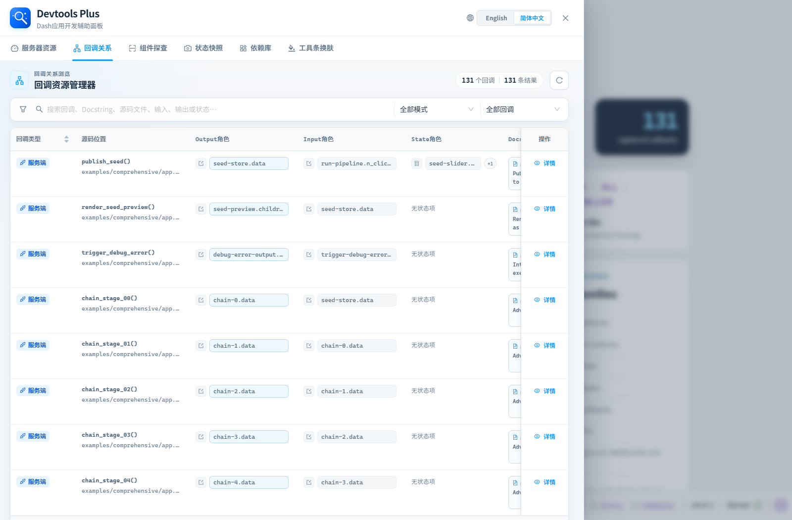

# 回调关系

回调关系工作区把 Dash 已注册回调转化为可搜索的开发视图。

## 浏览与筛选

可搜索回调名称、Docstring、源码文件、输入、输出和状态；再叠加服务端/客户端与可见性筛选，能够在大型应用图中快速收窄范围。

## 如何阅读一条回调

| 列 | 含义 |
| --- | --- |
| 回调类型 | 服务端回调或客户端回调注册。 |
| 源码位置 | 项目相对 Python 源码；本机存在受支持编辑器时可尝试打开。 |
| Output / Input / State 角色 | 已注册的依赖角色，支持展示多个值。 |
| Docstring | 可获取时展示 Python 函数说明。 |
| 详情 | 拓扑、源码类型、角色概览、注册元数据和运行行为。 |

详情页还会展示 Dash 支持的相关元数据，例如初始调用、可选依赖、后台执行、动态注册、持久回调、WebSocket、无输出回调、MCP 暴露及 `running` 映射。

## 范围与安全性

只有位于 `project_root` 下的回调源码会被识别为项目源码。服务端路径与本地编辑器路径不同时，请同时配置 `project_root` 和 `editor_project_root`。
