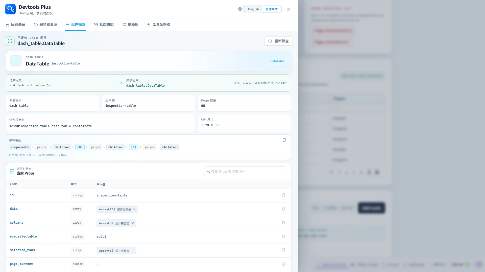

# 🔍 组件探查

> ✨ 点一下页面元素，就能顺藤摸瓜找到对应的 Dash 组件。

组件探查会把已渲染的页面元素定位回最近的所属 Dash 组件。

## 🧭 操作流程

1. 打开**组件探查**，点击**开始组件探查**。
2. 在运行中的应用页面上移动鼠标，最近的受支持 Dash 组件会被高亮。
3. 点击元素，面板会重新打开并展示组件身份、DOM 映射、布局路径与当前 Props。
4. 按 `Esc` 可取消探查而不选择元素。

探查用的点击会在到达目标控件前被拦截，因此选择按钮、输入框、表格单元格或分页控件时，不会同时触发该控件原本的操作。

## 🧩 探查结果

| 区域 | 可以回答的问题 |
| --- | --- |
| 选中元素 → 关联组件 | 点击的是哪个 DOM 元素，由哪个 Dash 组件拥有。 |
| 身份信息 | 命名空间、组件类型、ID、根 DOM 元素与尺寸。 |
| 布局路径 | 组件在 Dash 布局树中的位置；可复制用于排查问题。 |
| 当前 Props | 运行时 Prop 值、推断类型、搜索、复制、编辑和结构化值展开。 |
| 组件型属性值 | 可下钻进入 Prop 值中的已注册 Dash 组件，并通过探查面包屑返回上级。 |

Dash 开发工具自身的命名空间会被排除，因此探查焦点始终是应用页面而不是工具 UI。

当组件具有合法 ID 时，点击**重新探查**旁的**相关回调关系**，即可切换到回调关系板块，将组件 ID 填入搜索框并自动选择**精确 ID 搜索**，避免命中包含相同片段的其他组件。跳转会将回调类型和可见性恢复为“全部”，并回到第一页；字典 ID 也能匹配对应的模式匹配回调。没有合法 ID 的组件不显示此按钮。

## 编辑属性

非组件型属性的复制按钮旁提供编辑按钮。无论通过页面拾取还是从状态快照进入探查，都可以打开独立弹窗编辑当前组件的实时属性值。

- 字符串、数值、布尔值自动选中对应类型；数组和对象使用 JSON 模式。
- `null` 或未定义值先显示选择类型的提示；空字符串、`0` 和 `false` 仍会按实际类型识别。要写入 `null`，选择 JSON 模式并输入 `null`。
- 字符串、数值和 JSON 使用本地打包的浅色 Monaco Editor，布尔模式提供 True / False 选项。切换类型会保留本次弹窗内各类型的草稿。
- 编辑过程中，数值和 JSON 错误通过 Monaco 波浪线和悬停提示展示。弹窗仅在点击**确认更新**后显示校验错误；非法草稿不会修改运行中的组件。
- 字符串和 JSON 模式提供**格式化内容**按钮。类 JSON 对象或数组（包括单引号、未加引号的键名）会规范为双引号、两空格缩进的标准 JSON；普通字符串只清理行尾空白并统一换行符。字符串模式仍以字符串保存，格式化可在编辑器中撤销，不会直接更新组件。
- 包含 Dash 子组件的属性继续通过下钻探查查看，不提供编辑按钮。

点击**确认更新**后，通过浏览器端 `dash_clientside.set_props` 更新目标组件，并刷新探查结果。有 ID 的组件更新可以触发关联回调；无 ID 的组件通过布局路径更新。修改只作用于当前运行页面，不写回 Python 源码或已保存快照。若组件已被移除或替换，会提示重新探查。
