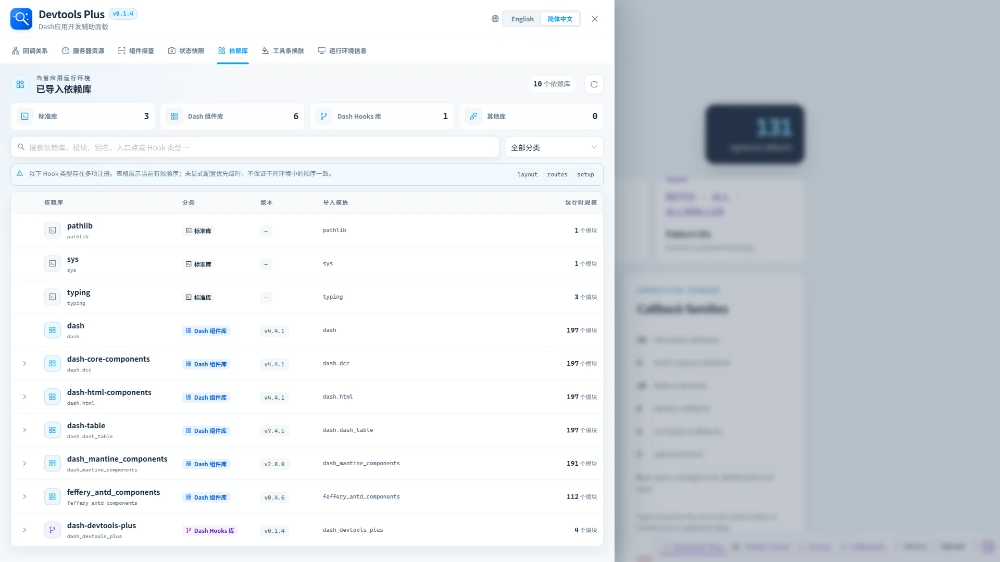

# 🧩 依赖库

> ✨ 只看项目真正导入了什么，不再被整个环境里的包干扰。

依赖库工作区汇总项目源码树中**直接导入**的库，而不是把 Python 环境中安装的每一个包都列出来。

## 🗂️ 分类

| 分类 | 检测结果 |
| --- | --- |
| 标准库 | 解析为 Python 标准库的直接导入。 |
| Dash 组件库 | `dash` 本身及检测到的 Dash 组件库。 |
| Dash Hooks 库 | 通过入口点发现或运行时注册的 Hook 包。 |
| 其他库 | 不属于以上分类的直接导入。 |

可通过分类卡片、分类选择器和搜索框收窄表格。表格展示依赖库、分类、可获取时的安装版本、导入模块名和运行时模块数量。

## 🔽 展开详情

Dash 组件库和 Hooks 库行可展开：

- 组件库行展示包模块、归属、导出成员、浏览器资源与项目别名。
- Hooks 库行展示入口点、来源、状态、Hook 类型和运行时注册明细。

清单遵循配置的 `project_root` 边界，并排除常见虚拟环境目录。项目内自定义模块（包括项目源码中手动注册的 Hooks）不会被当作“其他库”或外部依赖展示；第三方项目必须能够映射到已安装的 Python distribution 才会进入清单。它是面向开发的导入清单，不是锁文件分析或漏洞审计工具。
