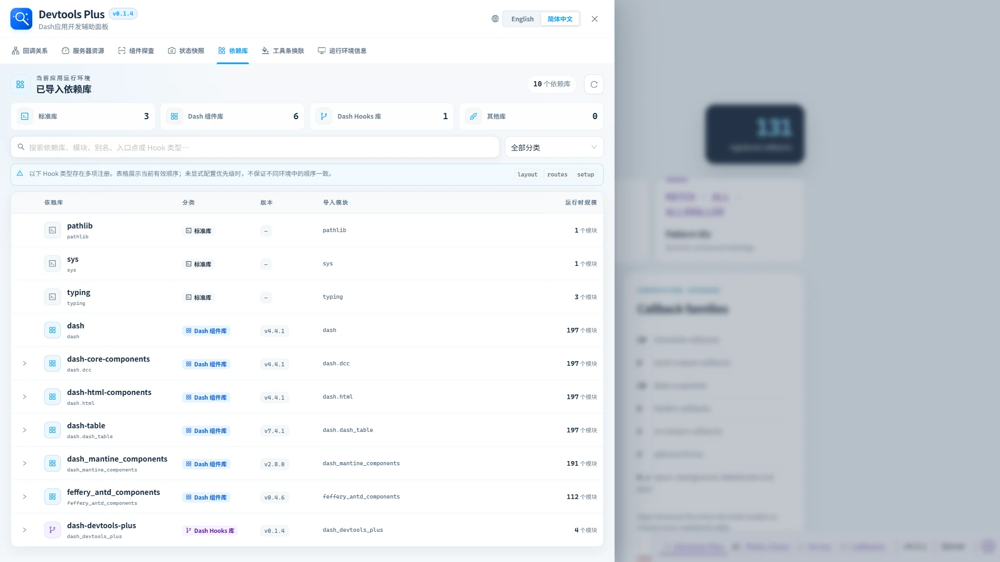

# 🧩 依赖库

> ✨ 只看项目真正导入了什么，不再被整个环境里的包干扰。

依赖库工作区汇总项目源码树中**直接导入**的库，而不是把 Python 环境中安装的每一个包都列出来。

## 🗂️ 分类

| 分类 | 检测结果 |
| --- | --- |
| 标准库 | 解析为 Python 标准库的直接导入。 |
| Dash 组件库 | `dash` 本身及检测到的 Dash 组件库。 |
| Dash Hooks 库 | 通过入口点发现或运行时注册的 Hook 包。 |
| 其他库 | 不属于以上分类的直接导入。 |

可通过可点击的分类卡片、分类选择器和搜索框收窄表格。搜索范围包括库名、版本、导入模块、组件别名、Hook 入口点和 Hook 类型。表格展示依赖库、分类、可获取时的安装版本、导入模块名和运行时模块数量。

## 🔽 展开详情

Dash 组件库和 Hooks 库行可展开：

- 组件库行展示包模块、归属、导出成员、浏览器资源与项目别名。
- Hooks 库行展示入口点、来源、状态、Hook 类型和运行时注册明细。

当同一种有序 Hook 存在多条注册时，工作区会提示涉及的类型并展示当前实际生效顺序；若未显式设置优先级，不应假定该顺序在不同环境中完全一致。

清单遵循配置的 `project_root` 边界，并排除常见虚拟环境目录。项目内自定义模块（包括项目源码中手动注册的 Hooks）不会被当作“其他库”或外部依赖展示；第三方项目必须能够映射到已安装的 Python distribution 才会进入清单。它是面向开发的导入清单，不是锁文件分析或漏洞审计工具。

未配置 `project_root` 时，从 Dash 应用所属模块开始检测，兼容 FastAPI，并以布局函数、回调函数补充入口。检测沿已经加载的本地模块追踪，不会扫描所有项目文件或进程中的全部模块；静态布局也会提供组件使用证据。根目录推断在进程重启后保持稳定，不会将组件库实现文件所在目录作为应用根目录。

源码解析支持 Python 编码声明、UTF-8 BOM、相对导入，以及模块名为字符串常量的 `importlib.import_module()` / `__import__()` 调用。刷新会重新读取源码和安装元数据，能发现后续加载的页面及包信息变化。任意表达式计算出的动态导入不一定能解析；源码不可读或包归属无法确定时，会显示“依赖检测不完整”，列出模块名与原因，不暴露文件路径。

安装包归属会核对模块实际文件，支持命名空间的不同提供者，并在元数据可用时识别 editable 安装。通过 Hook 注册参与应用、但未被应用源码直接导入的包会根据应用注册快照单独展示，不计入直接导入分类数量。
