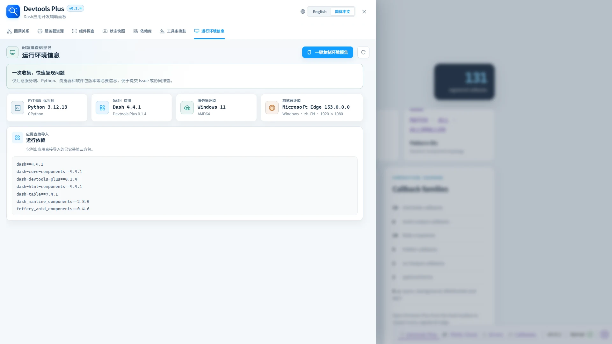

# 🧭 运行环境信息

> ✨ 一次收集问题复现所需的关键环境信息，并直接粘贴到 Issue。

“运行环境信息”位于功能面板最后，集中展示当前 Dash 应用的服务端运行时、浏览器环境和直接导入依赖。

## 📦 信息范围

| 区域 | 包含内容 |
| --- | --- |
| Dash 应用 | Dash 与 Dash Devtools Plus 版本。 |
| Python 运行时 | Python 版本与实现。 |
| 服务端环境 | 操作系统、系统版本与架构。 |
| 浏览器环境 | 浏览器及版本、平台、语言和当前视口。 |
| 运行依赖 | 按实际 Python 安装包去重，列出应用导入的第三方包；标准库和项目自定义模块不会显示。 |

点击右上角的 **一键复制环境报告**，即可得到 Markdown 格式的完整信息，可直接放入 GitHub Issue、工单或排查记录。刷新按钮会重新读取服务端信息和当前浏览器窗口尺寸。

Dash 内置的 `dash.dcc`、`dash.html` 和 `dash.dash_table` 统一归入 `dash`，不会将组件显示名称导出为独立安装包。已确认安装包但无法获取版本时，仍会保留并标注“版本未知”。检测不完整提示和通过注册参与应用的其他 Hook 包会同时出现在面板与复制报告中。这是一份应用导入清单，不是整个环境的锁文件。

该接口与其他 Devtools Plus 元数据接口一样，只在 Dash 调试模式和原生 Dev Tools UI 同时启用时可访问，并使用禁止缓存响应头。报告不会采集主机名、完整 User Agent、项目文件路径、标准库或项目自定义模块。
