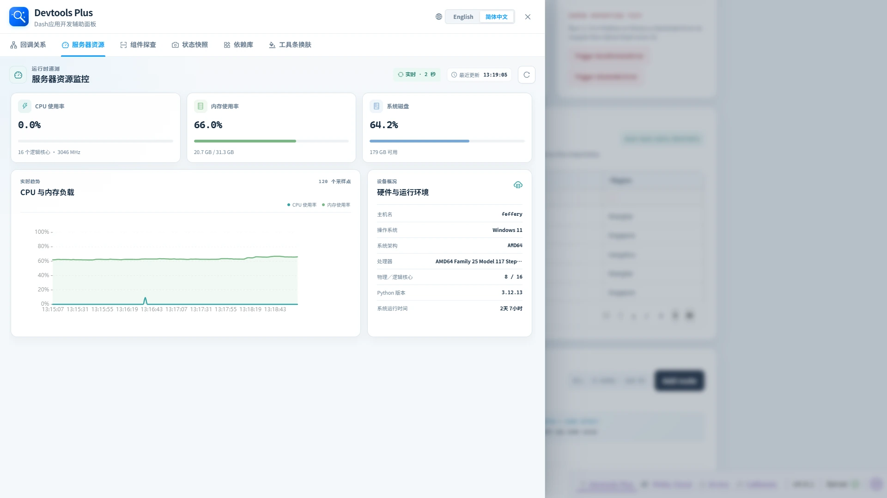

# 📡 服务器资源

> ✨ 开发时也能轻松掌握 Dash 应用背后机器的实时脉搏。

服务器资源工作区在开发 Dash 应用时提供宿主环境的紧凑实时视图。

## 👀 展示内容

| 区域 | 信息 |
| --- | --- |
| 资源卡片 | 当前 CPU、内存和系统磁盘使用率，并补充逻辑核心数/频率、已用/总内存和磁盘可用空间。 |
| 实时趋势 | 在调试页面会话期间每两秒采样一次，最多保留最近 120 个 CPU、内存采样点，约覆盖四分钟。图表采用渐变填充面积层与 AntV 交互式图例，点击“CPU 使用率”或“内存使用率”可显示或隐藏对应系列，新数据到达时仍保持当前图例选择。 |
| 硬件与运行环境 | 主机名、操作系统、架构、处理器、物理/逻辑核心、Python 版本和系统运行时间。 |

需要立即采样时可点击刷新。遥测数据只会提供给明确启用调试的 Devtools Plus 会话；它不是生产环境监控系统。

## 💡 适用场景

- 回调更新大型图表或布局时确认内存变化。
- 判断本地交互变慢是否同时出现 CPU 压力。
- 记录可复现开发问题所对应的运行环境信息。
