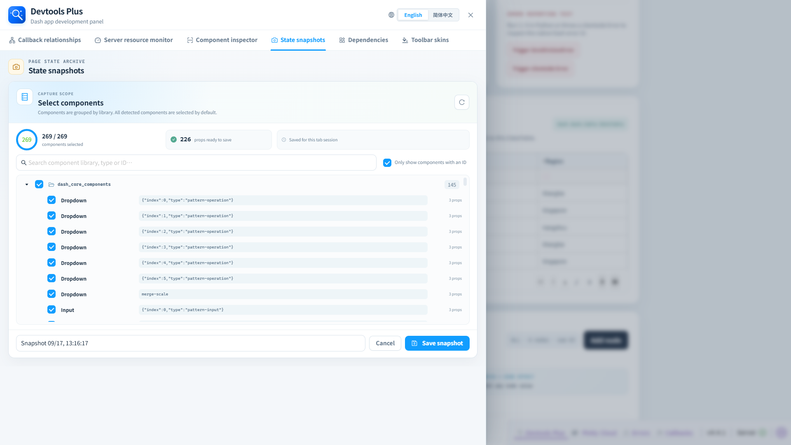

# 📸 状态快照

> ✨ 保存探索过程中的一个关键瞬间，随时在当前标签页回到那里。

状态快照可保存选中组件的 Props，并在同一个浏览器标签页中稍后还原。

## ✨ 创建快照

1. 点击**新建快照**。
2. 查看按组件库分组的组件；默认会选中当前检测到的全部组件。
3. 搜索、仅显示有 ID 的组件，或取消勾选不应保存的项。
4. 输入快照名称并保存。

## ↩️ 还原与删除

快照列表展示创建时间、组件数量和已保存 Props 数。还原会通过 Dash 客户端属性更新机制应用保存的值，可能触发回调，因此应将它视为真实的应用状态变更。删除快照后无法恢复。

## 🧱 存储边界

快照保存在浏览器会话存储中，仅作用于当前浏览器标签页；它不是服务端持久化或协作能力。存储空间不足时，面板会提示新建快照仅在刷新前可用。
