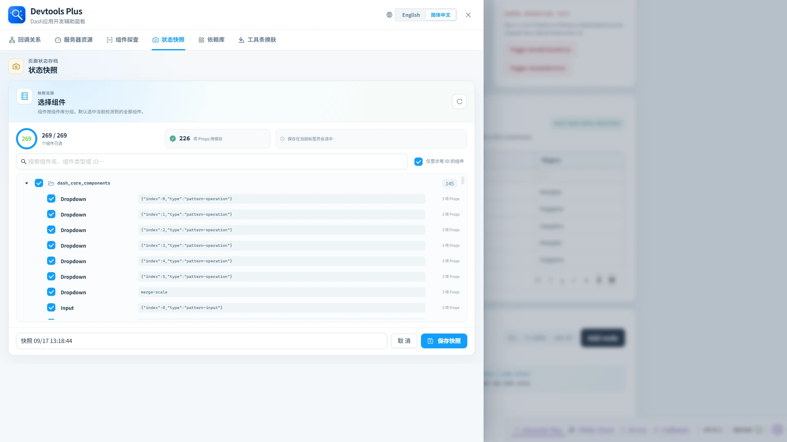

# 📸 状态快照

> ✨ 保存探索过程中的一个关键瞬间，随时在当前标签页回到那里。

状态快照可保存选中组件的 Props，并在同一个浏览器标签页中稍后还原。

## ✨ 创建快照

1. 点击**新建快照**。
2. 查看按组件库分组的组件；检测到的组件默认全部选中，但初始列表只显示带 ID 的组件。
3. 可以搜索；需要按布局路径定位无 ID 组件时，取消“仅显示带 ID 的组件”；也可取消勾选不应保存的项。
4. 输入快照名称并保存。

## ↩️ 还原与删除

快照列表展示路由、创建时间、组件数量、已保存 Props 数和序列化体积。还原时只会通过 Dash 客户端属性更新机制应用与当前布局不同的值；ID/路径或组件类型已不匹配的项目会被跳过，面板会提示部分恢复结果。还原可能触发回调，因此应将它视为真实的应用状态变更。删除快照后无法恢复。

## 🧱 存储边界

快照保存在浏览器会话存储中，并按 origin 与 pathname 隔离；每个页面在当前浏览器标签页中最多保留 12 条。它不是服务端持久化或协作能力。组件型结构 Props、`id` 以及无法 JSON 序列化的值不会参与还原。存储空间不足时，面板会提示新建快照仅在刷新前可用。
