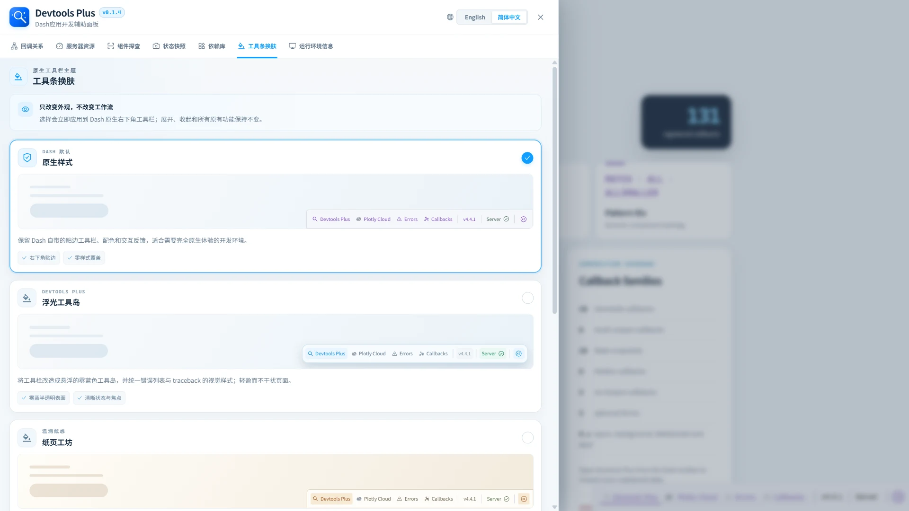

# 🎨 工具条换肤

> ✨ 让 Dash 原生 Dev Tools 的外观更贴合你的开发工作台。

该工作区只改变 Dash 原生 Dev Tools 工具栏及错误展示的外观，不改变原生工作流。

## 🌈 可用主题

| 主题 | 特征 |
| --- | --- |
| 原生样式 | 保留 Dash 贴边工具栏，不施加样式覆盖。 |
| 浮光工具岛 | 雾蓝半透明悬浮工具栏，并统一错误展示样式。 |
| 纸页工坊 | 暖白纸面、细线结构与琥珀强调色。 |
| 薄荷电路 | 薄荷白胶囊式工具栏，搭配青绿状态反馈。 |
| 珊瑚工作台 | 以淡珊瑚层次呈现更轻快的工作台观感。 |

选择主题卡片后会立即生效。所选主题保存在浏览器存储中，作用于原生工具栏和 traceback/错误展示，并且可随时切回**原生样式**。它只影响外观，原生工具栏的控件和行为保持不变。
